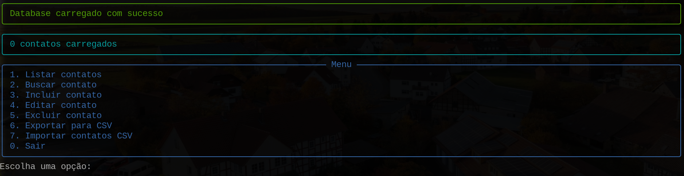
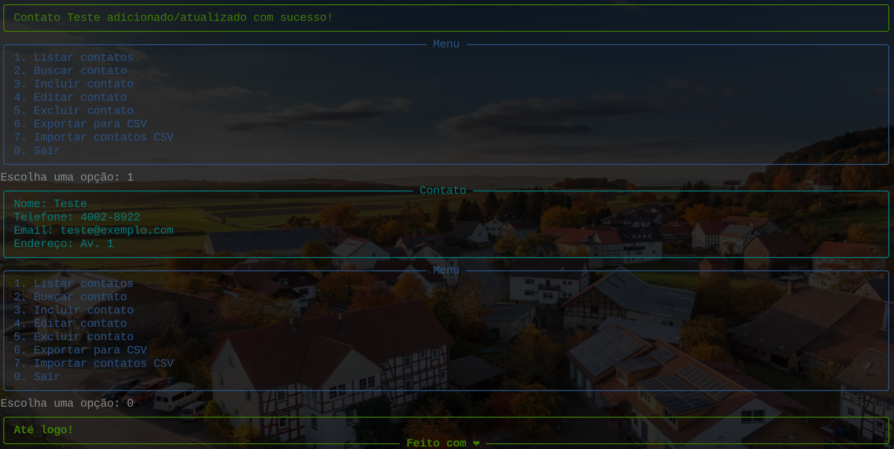

# Agenda em Python com "rich"

Uma lista de contatos com interface visual avançada utilizando a biblioteca `rich`. Esta aplicação facilita a gestão de contatos através de uma interface em linha de comando com suporte para CSV.

## Dependências

- git
- rich
- python3

## Instalação e Uso

1. Clone o repositório:

   ```sh
   git clone https://github.com/rafF1z-ft/Simple-Agenda-Python.git

Se o repositório foi clonado como usuário root e grupo root, ajuste as permissões conforme necessário. Exemplo para um usuário comum:
    
    ```sh
    chown usuario:users Simple-Agenda-Python

## Instale a biblioteca rich:
    ```sh
    python3 -m pip install rich

### Para visualizar exemplos de uso do rich:
    ```sh
    python3 -m rich

### Execute o programa:
    ```sh
    python3 main.py


## Contribuições
Contribuições são bem-vindas! Sinta-se à vontade para abrir issues e enviar pull requests.

##




##
